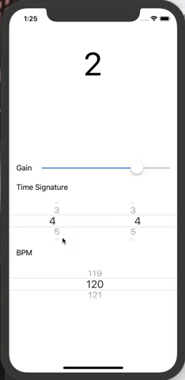

## Brief
An AUAudioUnit-based metronome demostration app



## Implemented Features
 - Beat counter in audio callback
 - Use an `AVAudioUnitSampler` as click sound synthesizer
 - Adujstable BPM
 - Adjustable time signature X/Y for X and Y in `[1, 32]`

## How to Use
 - Copy AudioUnitMetronome.m,  AudioUnitMetronome.h and MetronomeBeatChangedPerceivable.h to your project
 - Register `AudioUnitMetronome` as below
 
 ```
    static dispatch_once_t onceToken;
    dispatch_once(&onceToken, ^{
        [AUAudioUnit registerSubclass:[MetronomeAudioUnit class]
               asComponentDescription:desc
                                 name:@"metr"
                              version:0];
    });
 ```
   Note: make sure `AudioUnitMetronome` has been registered before you creating it.
 - Create an `AudioUnitMetronome` via 

 ```
 [AVAudioUnit instantiateWithComponentDescription:desc
                                             options:kAudioComponentInstantiation_LoadOutOfProcess
                                   completionHandler:^(__kindof AVAudioUnit * _Nullable audioUnit, NSError * _Nullable error) {
//connect your audio nodes here
}
 ```
 - Set an `id<MetronomeBeatChangedPerceivable>` as delegate for `AudioUnitMetronome` if you want to get notification while beat changed, e.g. play click sound or display beat number.

 
For more informations, may refer to ViewController.m for more details.
 


